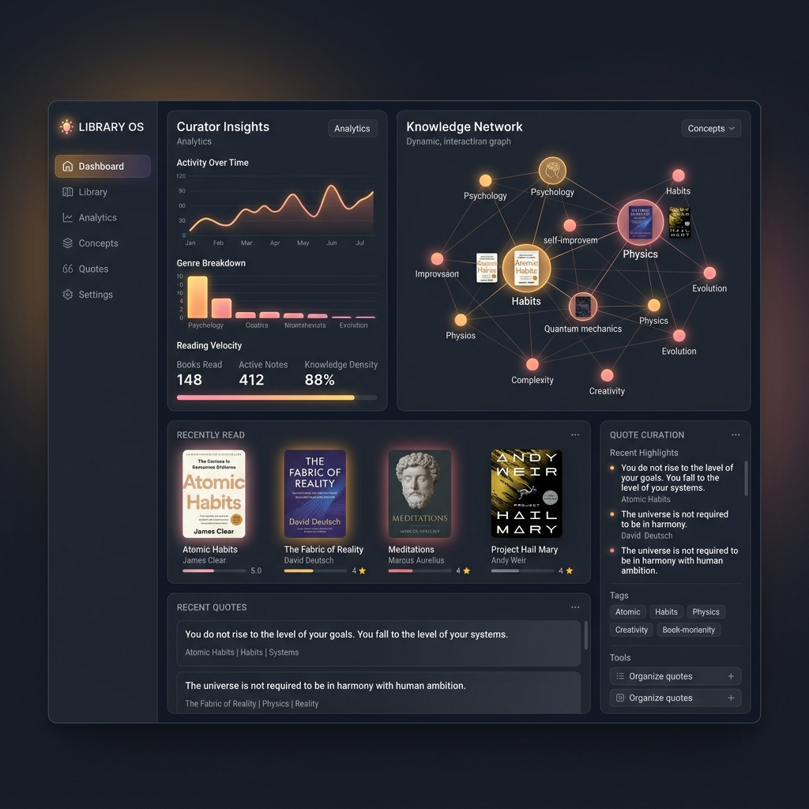

# Library OS

**The open-source Library Intelligence System.**
Capture, extract, enrich, and publish every book you read into a permanent deep-dive on your own website.

[](https://vercel.com/new/clone?repository-url=https%3A%2F%2Fgithub.com%2Ffrankxai%2Flibrary-os&project-name=my-library&repository-name=my-library)
[](./LICENSE)
[](./claude-plugin.json)

> Live reference: the current FrankX Library, with dynamic OG images and quote APIs, at [frankx.ai/library](https://frankx.ai/library) · Architecture: [frankx.ai/library/approach](https://frankx.ai/library/approach). Counts are intentionally registry-driven, never hard-coded.



## Install (5 paths, pick one)

```bash
# Bootable Next.js site
git clone https://github.com/frankxai/library-os.git my-library && cd my-library && npm install && npm run dev

# Or — Claude Code plugin only (commands + skill + subagent)
rsync -av <(curl -sL https://github.com/frankxai/library-os/archive/main.tar.gz | tar xz)/library-os-main/.claude/ .claude/

# Or — via ACOS
npx @frankx/agentic-creator-os init  # library-os included from v11+
```

Full install paths in [`INSTALL.md`](./INSTALL.md) — bootable site, drop-in to existing Next.js, plugin-only, cross-AI (ChatGPT/Cursor/Codex/Gemini), via ACOS.

---

## Why

Readers forget up to ninety percent of what they read within a week. Kindle highlights die in Kindle. Notion docs scatter. Goodreads knows what you read but not what you took from it.

Every book you've read is capital. Without a system to compound it, that capital depreciates to zero the moment the book goes back on the shelf.

Library OS is the system that makes it compound. Every book becomes a permanent, intelligent, schema-rich page on your own website — TOC'd, quoted, chapter-distilled, FAQ-answered, cross-linked, SEO-ready, LLM-citable. In six months you own a library that compounds for decades.

## What you get

- **Data schema** — one TypeScript interface for everything a book can be
- **Next.js App Router template** — `/library` index + `/library/{slug}` deep-dive + `/library/approach` showcase
- **Four slash commands** — `/library-capture`, `/library-add`, `/library-deepen`, `/library-research`
- **One skill** — `library-os` (documents the full workflow)
- **One subagent** — `book-distiller` (the extraction specialist)
- **Full JSON-LD schema** — BreadcrumbList + Article + Review + FAQPage + Quotation on every book page
- **Two example deep-dives** — Profit First + The Fabric of Reality (ship real books in under an hour)
- **Quote Sharing Suite (V2)** — Selection-based sharing, desktop floating `QuoteShareToolbar`, and tap-to-share badge overlay for touch devices.
- **Dynamic OG Image Engine (V2)** — Dynamic 1200x630 PNG card generation per quote page (`/library/{slug}/q/{n}`) for premium social sharing previews.
- **Quote Vault & APIs (V2)** — Unified Quote Vault page (`/library/quotes`) displaying all curated passages, and JSON Quote APIs (`/api/quote/random`, `/api/quote/today`).

## Quick start (5 minutes to live)

```bash
# 1. Clone
git clone https://github.com/frankxai/library-os.git my-library
cd my-library

# 2. Install
npm install

# 3. Run
npm run dev
# open http://localhost:3000/library
```

Edit `data/book-reviews.ts` to add your first book. Redeploy via `git push` — Vercel picks it up.

## Alternative: cherry-pick into your existing Next.js project

If you already have a Next.js App Router site, copy these files into it:

```
app/books/types.ts
app/books/lib/books-registry.ts       ← customize for your own books
app/library/page.tsx
app/library/[slug]/page.tsx
app/library/approach/page.tsx         ← optional showcase page
data/book-reviews.ts                  ← your data
public/images/library/                ← book cover JPEGs
.claude/commands/library-*.md         ← the three slash commands
.claude/skills/library-os/SKILL.md    ← the workflow skill
.claude/agents/book-distiller.md      ← the extraction subagent
```

Requires: Next.js 14+ App Router, Tailwind CSS v3+, TypeScript. No other dependencies.

## The source-aware workflow

```
PRIVATE CAPTURE ─► EVIDENCE ─► DISTILL ─► CONNECT ─► REVIEW ─► PUBLISH
      │                 │            │           │          │          │
      ▼                 ▼            ▼           ▼          ▼          ▼
photo, notes      edition/pages   insights     practice   approval   /library/{slug}
kindle, voice      + rights note  quotes       links      boundary   (live, SEO+AEO)
```

**1 — PRIVATE CAPTURE.** A photo of handwritten margin notes, a Kindle highlights export, a voice memo, or a title enters an owner-controlled inbox. The raw signal is preserved; it is not automatically public.

**2 — EVIDENCE + DISTILL.** Run `/library-capture` for photos/notes first, then `/library-add "Book Title"` for the approved baseline entry. Record source pages and translator when visible; create a field note instead of a fake whole-book summary when evidence is partial.

**3 — CONNECT + REVIEW.** Run `/library-deepen {slug}` only where evidence supports it, then `/library-research {slug}`. Add an original practice and verified connections. Explicitly review the public/private split.

**4 — PUBLISH.** `git commit && git push`. Vercel redeploys the approved public projection to a permanent URL with structured data and tested links.

## The data schema

`app/books/types.ts` — the spine of the system.

```ts
interface BookReview {
  // Identity
  slug, title, author, coverImage, rating, reviewDate, categories, readingTime

  // Core content (required)
  keyInsights: string[]   // exactly 5
  bestFor: string[]       // 3–4

  // AEO layer (optional, strongly recommended)
  tldr?: string
  faq?: Array<{ q, a }>
  publicationYear?: number

  // Deep-dive layer (optional — progressive depth)
  quotes?: BookQuote[]                  // text, chapter, context
  chapters?: BookChapterSummary[]       // number, title, keyIdea, summary
  continueReading?: RelatedReadingItem[]
  videos?: BookVideo[]

  // Wiring
  amazonUrl?: string
  relatedBook?: string    // links to your own books via booksRegistry
  hasCover?: boolean      // gates next/image render
}
```

Books without optional fields render as concise reviews. Books with all fields render as full knowledge hubs. One template, progressive depth.

## The three slash commands

| Command | Purpose | Writes to |
|---|---|---|
| `/library-capture` | Separate photo/note evidence from the public artifact | capture record + recommendation |
| `/library-add` | Create a new entry from just a title | `data/book-reviews.ts`, `public/images/library/` |
| `/library-deepen` | Add quotes + chapters to existing entry | `data/book-reviews.ts` |
| `/library-research` | Add continueReading + videos | `data/book-reviews.ts` |

Run `/library-capture` first for photos, notes, Kindle exports, and voice memos. The other commands are idempotent. Full documentation in [.claude/commands/](./.claude/commands/).

## Cross-AI compatibility

| Tool | Native support | How to use |
|---|---|---|
| Claude Code | ✅ | Slash commands + skill + subagent all work out of the box |
| ChatGPT / Claude.ai (web) | — | Paste the prompt from `.claude/commands/library-*.md`, paste book details, get structured TypeScript back |
| Cursor / Codex / Gemini CLI | — | Read the command files as plain-text instructions, execute the steps |
| Pen & paper | — | The schema and template work without any AI. A hand-curated library is always valid. |

See [`docs/cross-ai-guide.md`](./docs/cross-ai-guide.md) for paste-ready prompts.

## Deployment targets

Library OS ships as a Next.js App Router app, but the **spine** (the `BookReview` TypeScript type + the JSON-LD schema emission) is framework-neutral.

| Stack | Port effort | Notes |
|---|---|---|
| **Next.js App Router** | Zero | Direct. This repo. |
| **Astro / Starlight** | Small | Port `app/library/` to `src/pages/library/`. Schema unchanged. |
| **SvelteKit** | Small | `routes/library/+page.svelte` and `+page.svelte` in `[slug]`. |
| **Hugo / Jekyll / 11ty** | Medium | Each BookReview becomes a markdown file with frontmatter. |
| **Plain HTML** | Medium | A small build script renders static pages. Schema works standalone. |


## Source-aware book photos

A reading photo is evidence, not an instruction to publish the whole source. Run `/library-capture` before `/library-add`.

- Preserve raw photos, full transcripts, and private reflections in an owner-controlled private inbox.
- Put only approved provenance, short verified excerpts, original commentary, and contextual images on the public page.
- Use a **field note** when a few pages are the source; do not fabricate the book’s unseen chapters.
- Keep each public entry useful by adding one practice and verified internal/external connections.
- A changed library slug needs an explicit 301 redirect. One canonical production domain and one canonical production repository should govern metadata, sitemap, and links.

See [the capture contract](./docs/schema.md#source-aware-public-projection).

## Documentation

- [`MANIFESTO.md`](./MANIFESTO.md) — why we build libraries
- [`docs/getting-started.md`](./docs/getting-started.md) — zero-to-first-book walkthrough
- [`docs/cross-ai-guide.md`](./docs/cross-ai-guide.md) — paste-ready prompts for non-Claude-Code setups
- [`docs/schema.md`](./docs/schema.md) — every field explained
- [`.claude/skills/library-os/SKILL.md`](./.claude/skills/library-os/SKILL.md) — the canonical workflow documentation

## Contributing

Issues and PRs welcome. The spirit of Library OS is **curation over automation** — AI helps you move faster, but the final judgment on what deserves to be in your library is yours.

## License

MIT — see [LICENSE](./LICENSE).

## Credits

Built and maintained by [Frank](https://frankx.ai). Reference library at [frankx.ai/library](https://frankx.ai/library).

Inspired by the intuition that the best tools for thought are the ones you own and the ones that outlive their vendors.
